# Retail Forecasting

## Files

Retail-Forecasting_files/figure-gfm/: Contains images to include in README.md.

Retail Forecasting.Rmd: Original .Rmd file where I created code

Retail-Forecasting.md: GitHub friendly version

# Introduction

This is a project completed as part of a University assignment, where we were tasked with implementing different forecasting methods learnt to attempt to predict turnover numbers for our generated series. In particular, exploration and analysis of different ARIMA and ETS models was undertaken to decide the optimal forecasting model. 

# Loading packages and data

``` r
# Loading packages

library(fpp3)
library(knitr)

# Use your student ID as the seed
set.seed(28785649)

myseries <- aus_retail %>%
  # Remove discontinued series
  filter(!(`Series ID` %in% c("A3349561R","A3349883F","A3349499L","A3349902A",
                        "A3349588R","A3349763L","A3349372C","A3349450X",
                        "A3349679W","A3349378T","A3349767W","A3349451A"))) %>%
  # Select a series at random
  filter(`Series ID` == sample(`Series ID`, 1))
```

# Statistical features of the original data

``` r
# Plotting the data

original_plot <- myseries %>%
  autoplot(Turnover) +
  labs(title = "Takeaway Food Services",
       subtitle = "New South Wales",
       y = "Turnover [$million AUD]") +
  theme_bw()

# gg_season plot

season_plot <- myseries %>%
  gg_season(Turnover) +
  labs(title = "Takeaway Food Services",
       subtitle = "New South Wales",
       y = "Turnover [$million AUD]") +
  theme_bw()

# gg_subseries plot

series_plot <- myseries %>%
  gg_subseries(Turnover) +
  labs(title = "Takeaway Food Services",
       subtitle = "New South Wales",
       y = "Turnover [$million AUD]") +
  theme_bw()

# ACF

acf_original <- myseries %>%
  ACF(Turnover) %>%
  autoplot()
```

<!-- -->

Between 1982 and 2018, we can see that there has been a generally upward
trend in the total turnover from takeaway food services in New South
Wales. Analysing the time series plot, we can also see some cyclical
behaviour. At the same time, there is evidence of heteroskedasticity due
to the difference in variation at the beginning of the time series
compared to the end. There is also potential seasonality, which we will
be able to confirm in the next plot.

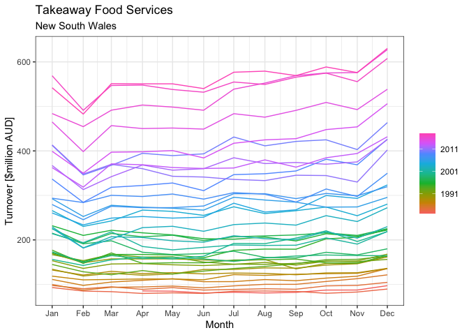<!-- -->

The above time series seasonal plot confirms that there is seasonality
in the data. Besides a few years, turnover for takeaway food service
revenue in New South Wales tends to experience a drop in the first two
months of the year, with the minimum turnover for most years occurring
in February, then slowly increases with slight dips along the way,
peaking in December.

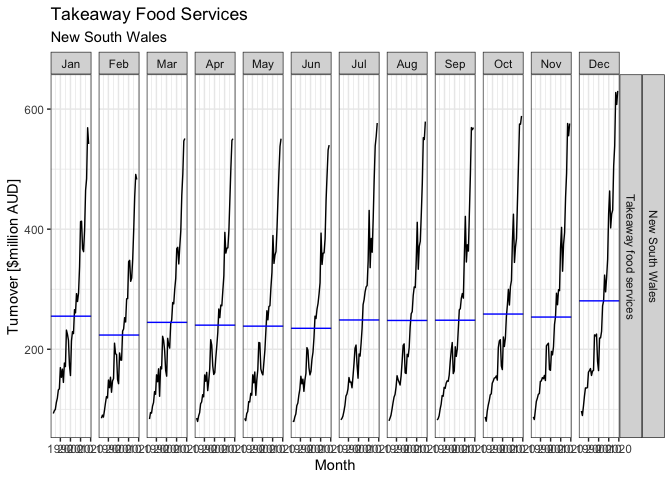<!-- -->

The above seasonal subseries further confirms that there is seasonality
in the data. Besides a few years, turnover of takeaway food service
revenue in New South Wales tends to experience a drop in the first two
months of the year, with the trough occurring in February, then slowly
increases with slight dips along the way, peaking in December.

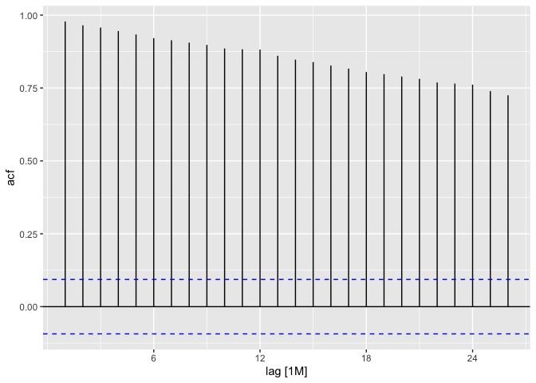<!-- -->

Finally, looking at the ACF, we can see there is clear evidence of
autocorrelation, as each of the lags are significant.

# Transformation

After exploring the statistical features of the data, it is important to
apply certain changes to our data. Firstly, to deal with the
heteroskedasticity that is present in the data, while also making our
model more simple, we can look to apply a mathematical transformation.

We can first look at the potential of a Box-Cox transformation:

``` r
# Box-Cox 

# Ideal value of lambda

lambda_myseries <- myseries %>%
  features(Turnover,
           guerrero) %>%
  pull(lambda_guerrero)

lambda_myseries %>%
  kable()
```

|         x |
|----------:|
| 0.0860637 |

Our value of lambda is 0.086, which is close enough to 0, hence we can
use a log transformation instead.

``` r
# Plotting our log transform

transformed_plot <- myseries %>%
  autoplot(log(Turnover)) +
  labs(title = "Takeaway Food Services - Log Transformed",
       subtitle = "New South Wales",
       y = "Turnover [$million AUD]") +
  theme_bw()

transformed_plot
```

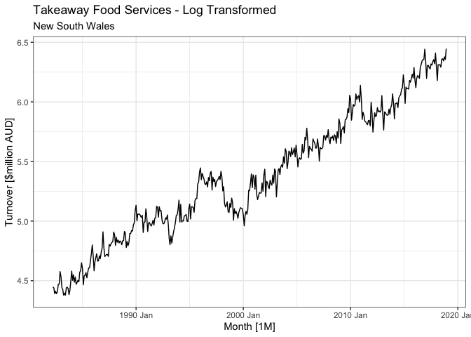<!-- -->

While our variance appears constant over time after performing a log
transformation, our data is clearly not stationary still, therefore we
can look to difference our data. First, we will look to seasonally
difference our data.

``` r
# Seasonal differencing

myseries %>%
  features(log(Turnover),
           unitroot_nsdiffs)  %>%
  kable()
```

| State           | Industry               | nsdiffs |
|:----------------|:-----------------------|--------:|
| New South Wales | Takeaway food services |       1 |

After completing a unit root test, this tells us to apply one seasonal
difference, which after applying can be seen below.

``` r
# Plot after applying log transformation and one seasonal difference

myseries %>%
  autoplot(log(Turnover) %>%
             difference(lag = 12, 
                        differences = 1)) +
  labs(title = "Takeaway Food Services",
       subtitle = "New South Wales",
       y = "Turnover [$million AUD]") +
  theme_bw()
```

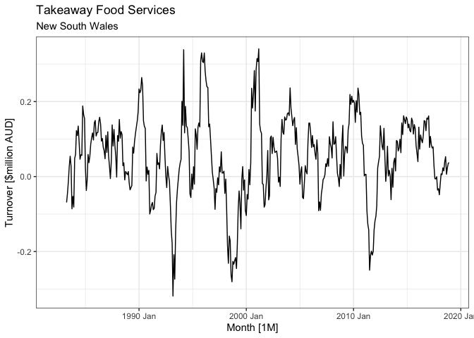<!-- -->

After applying our seasonal difference, our data appears to be
stationary, however we will check to see if we need to apply a first
order difference.

``` r
# First order differencing

myseries %>%
  features(log(Turnover) %>%
             difference(lag = 12, 
                        differences = 1),
           unitroot_kpss) %>%
  kable()
```

| State           | Industry               | kpss\_stat | kpss\_pvalue |
|:----------------|:-----------------------|-----------:|-------------:|
| New South Wales | Takeaway food services |   0.065491 |          0.1 |

After performing a unit root test, we attain a p-value of 0.1. As a
result, we can reject the null hypothesis that a unit root exists (or in
other words that our data is not stationary), hence telling us that no
further differencing is required. Below, we will visualise the final
results of our transformations and differencing compared to our original
data.

``` r
# Applying transformation and plotting

transformed_differenced_plot <- myseries %>%
  autoplot(log(Turnover) %>%
             difference(lag = 12, 
                        differences = 1)) +
  labs(title = "Takeaway Food Services - Transformed and Differenced",
       subtitle = "New South Wales",
       y = "Turnover [$million AUD]") +
  theme_bw()
```

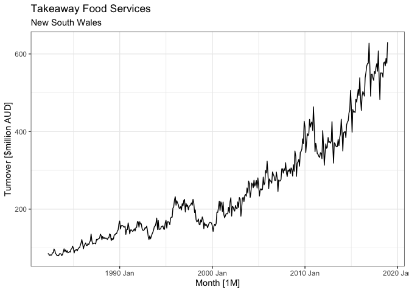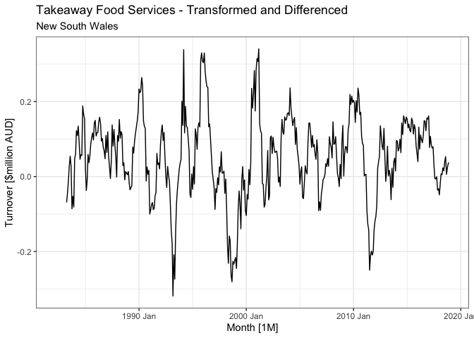

# Shortlist of different ARIMA and ETS models

## ETS models

<!-- -->

Looking firstly at our log transformed data will help us create a
shortlist of potential ETS models. We can see here after performing a
log transformation, the variance seems constant, meaning our data looks
homoskedastic, and as a result our error and seasonality parameters on
our ETS models can both be additive (“A”). In terms of the trend, we can
see that the trend is linear, so an additive trend parameter (“A”) may
be appropriate. However, for long term forecasts, an additive trend
tends to over-forecast, hence we can also consider damping the trend for
our trend parameter (“Ad”) to account for this. We will also let the
ETS() function select the best model based on the set criteria to
compare the hand-picked models.

As a result, we will end up with the following ETS models:

-   **ETS(A, A, A)**
-   **ETA(A, Ad, A)**
-   **ETS()**

## ARIMA models

To determine a shortlist of potential ARIMA models, we can look at our
the ACF (Autocorrelation Function) and PACF (Partial Autocorrelation
Function) of our transformed and differenced data.

``` r
# Plotting ACF and PACF

myseries %>%
  gg_tsdisplay(log(Turnover) %>%
             difference(lag = 12, 
                        differences = 1),
             plot_type = "partial")
```

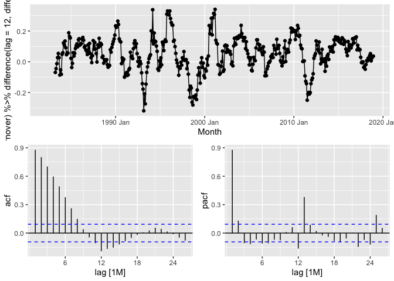<!-- -->

Looking at the ACF and PACF of our transformed and differenced data, we
can see clearly that our ACF dies down in a sinusoidal matter, hence it
would be ideal to choose our AR(p) parameters as opposed to MA(q). To
determine the order of p (for our non-seaonal component), as well as P
(for our seasonal component), we can look at our PACF. Firstly, we can
see that our first significant seasonal spike is at lag 12, and lag 24
is barely past the blue line, therefore it can be disregarded as
significant. As a result, for our seasonal component, we can choose P to
be 1. Now, we can see there are significant spikes at time 1, 13 and 25,
and a significant spike at lag 2, and potentially at lag 14. Since we
have monthly data and have determined that our seasonal component P to
be 1, setting our non-seasonal component p to be 2 will look after these
lags. This is due to the fact that there is an interaction between the
non-seasonal and seasonal component of our ARIMA model, so for example,
lag 1 and 2 will interact lag 12 will interact to look after the
significant spike at lags 13 and 14. Further, a constant is required
since the data does not appear to be completely centered on 0.

Therefore, we can choose one potential ARIMA model to be as follows:

-   **ARIMA(2, 0, 0)(1, 1, 0)\[12\]**

We can also include some variations of this, also including an MA(q)
component, and similar to above, choosing ones that are selected by the
ARIMA() function to be the ideal models (both using stepwise/greedy and
a brute-force algorithm).

As a result, our shortlist of ARIMA models will be as follows:

-   **ARIMA(2, 0, 0)(1, 1, 0)\[12\] w/drift**
-   **ARIMA(2, 0, 1)(1, 1, 1)\[12\] w/drift**
-   **ARIMA(2, 0, 1)(1, 1, 2)\[12\] w/drift**
-   **ARIMA(2, 0, 2)(1, 1, 1)\[12\] w/drift**
-   **ARIMA()**
-   **ARIMA(stepwise = FALSE, approx = FALSE)**

Now, we can combine our shortlisted ETS and ARIMA models to come up with
a shortlist of potential models to forecast our data.

``` r
# Creating a shortlist of potential ETS and ARIMA models

fit_shortlist <- myseries %>%
  filter(year(Month) < 2017) %>%
  model(
    ets_aaa = ETS(log(Turnover) ~ error("A") + trend("A") + season("A")),
    ets_aada = ETS(log(Turnover) ~ error("A") + trend("Ad") + season("A")),
    ets_auto = ETS(log(Turnover)),
    arima_200110 = ARIMA(log(Turnover) ~ 1 + pdq(2, 0, 0) + PDQ(1, 1, 0)),
    arima_201111 = ARIMA(log(Turnover) ~ 1 + pdq(2, 0, 1) + PDQ(1, 1, 1)),
    arima_201112 = ARIMA(log(Turnover) ~ 1 + pdq(2, 0, 1) + PDQ(1, 1, 2)),
    arima_202111 = ARIMA(log(Turnover) ~ 1 + pdq(2, 0, 2) + PDQ(1, 1, 1)),
    arima_auto = ARIMA(log(Turnover)),
    arima_best = ARIMA(log(Turnover), stepwise = FALSE, approx = FALSE)
  )
```

After creating a shortlist of models, we have applied our model to our
*training data* (being all data in the dataset besides the last two
years), and to compare models we can firstly look at the AIC.

``` r
# Evaluating the AIC for ETS and ARIMA models

fit_shortlist %>%
  report() %>%
  arrange(-AIC) %>%
  select(-ar_roots, -ma_roots) %>%
  kable()
```

| State           | Industry               | .model        |    sigma2 |  log\_lik |        AIC |       AICc |         BIC |       MSE |      AMSE |       MAE |
|:----------------|:-----------------------|:--------------|----------:|----------:|-----------:|-----------:|------------:|----------:|----------:|----------:|
| New South Wales | Takeaway food services | ets\_aada     | 0.0017708 |  71.90770 |  -107.8154 |  -106.0968 |   -35.21985 | 0.0016986 | 0.0027871 | 0.0312630 |
| New South Wales | Takeaway food services | ets\_aaa      | 0.0017661 |  71.93248 |  -109.8650 |  -108.3311 |   -41.30250 | 0.0016984 | 0.0027215 | 0.0312019 |
| New South Wales | Takeaway food services | ets\_auto     | 0.0017661 |  71.93248 |  -109.8650 |  -108.3311 |   -41.30250 | 0.0016984 | 0.0027215 | 0.0312019 |
| New South Wales | Takeaway food services | arima\_200110 | 0.0022307 | 661.56157 | -1313.1231 | -1312.9728 | -1293.10370 |        NA |        NA |        NA |
| New South Wales | Takeaway food services | arima\_201112 | 0.0017346 | 708.35161 | -1400.7032 | -1400.3396 | -1368.67212 |        NA |        NA |        NA |
| New South Wales | Takeaway food services | arima\_201111 | 0.0017297 | 708.36324 | -1402.7265 | -1402.4444 | -1374.69928 |        NA |        NA |        NA |
| New South Wales | Takeaway food services | arima\_202111 | 0.0017188 | 710.01215 | -1404.0243 | -1403.6607 | -1371.99320 |        NA |        NA |        NA |
| New South Wales | Takeaway food services | arima\_auto   | 0.0017196 | 709.52935 | -1405.0587 | -1404.7766 | -1377.03150 |        NA |        NA |        NA |
| New South Wales | Takeaway food services | arima\_best   | 0.0017250 | 708.01505 | -1406.0301 | -1405.8797 | -1386.01066 |        NA |        NA |        NA |

Comparing firstly our different ETS models, we can see that our *ETS(A,
Ad, A)* model gives us the lowest AIC, implying it is a more
parsimonious model than our other ETS models from our shortlist. In
terms of our ARIMA models, we can see that our *ARIMA(2, 0, 0)(1, 1,
0)\[12\] w/drift* gives us the lowest AIC, which again implies it is a
more parsimonious model than our other ARIMA models, however it is not
far off from our other ARIMA models. Before concluding they are the best
models out of each of the two classes of models, we can compare to see
how they perform against our test set.

``` r
# Evaluating accuracy metrics on 2 year forecasts for ETS and ARIMA models

fit_shortlist %>%
  forecast(h = 24) %>%
  accuracy(myseries) %>%
  arrange(RMSE) %>%
  kable()
```

| .model        | State           | Industry               | .type |          ME |     RMSE |       MAE |        MPE |     MAPE |      MASE |     RMSSE |      ACF1 |
|:--------------|:----------------|:-----------------------|:------|------------:|---------:|----------:|-----------:|---------:|----------:|----------:|----------:|
| arima\_auto   | New South Wales | Takeaway food services | Test  |  -2.0670895 | 10.23568 |  8.108701 | -0.4036503 | 1.469109 | 0.3496730 | 0.3274988 | 0.6451296 |
| arima\_202111 | New South Wales | Takeaway food services | Test  |  -0.9603758 | 10.96902 |  8.863344 | -0.2144434 | 1.608348 | 0.3822156 | 0.3509625 | 0.6810354 |
| arima\_best   | New South Wales | Takeaway food services | Test  | -13.1495822 | 16.28152 | 13.149582 | -2.3675249 | 2.367525 | 0.5670518 | 0.5209403 | 0.5627138 |
| arima\_201111 | New South Wales | Takeaway food services | Test  | -13.7577347 | 16.91453 | 13.757735 | -2.4832361 | 2.483236 | 0.5932773 | 0.5411939 | 0.5772068 |
| arima\_201112 | New South Wales | Takeaway food services | Test  | -14.2661898 | 17.41003 | 14.266190 | -2.5616522 | 2.561652 | 0.6152035 | 0.5570479 | 0.5747639 |
| ets\_aada     | New South Wales | Takeaway food services | Test  | -34.8269558 | 36.44030 | 34.826956 | -6.2975487 | 6.297549 | 1.5018492 | 1.1659365 | 0.5832856 |
| ets\_aaa      | New South Wales | Takeaway food services | Test  | -48.7082347 | 51.27282 | 48.708235 | -8.7330882 | 8.733088 | 2.1004541 | 1.6405148 | 0.6809110 |
| ets\_auto     | New South Wales | Takeaway food services | Test  | -48.7082347 | 51.27282 | 48.708235 | -8.7330882 | 8.733088 | 2.1004541 | 1.6405148 | 0.6809110 |
| arima\_200110 | New South Wales | Takeaway food services | Test  | -48.0348398 | 54.22091 | 48.188567 | -8.5348655 | 8.561887 | 2.0780444 | 1.7348412 | 0.7725011 |

After applying our models onto our training data, producing forecasts on
our test data and comparing it to our actual data, we can see our above
analysis is consistent with the metrics above (RMSE and MAE) for our ETS
models, with an ETS(A, Ad, A) model giving us our lowest values of RMSE
and MAE, however our analysis for our ARIMA models is inconsistent.

Our automatically selected ARIMA model using the stepwise approach with
the ARIMA() function gives us the best predictions on our test set,
which is evident with the lowest RMSE and MAE overall, being an
ARIMA(2,0,2)(0,1,1)\[12\] w/ drift. The ARIMA model that gave us the
lowest AIC was ARIMA(2,0,0)(1,1,0)\[12\] w/ drift, which in fact gave us
notably lower RMSE and MAE values. The AIC can tell us which model is a
“better fit”, but ultimately we need to find a balance between what
model is a better fit, and what makes accurate predictions. The AIC
values are not significantly different between the two ARIMA models,
hence we can choose the ARIMA model with the significantly better RMSE -
ARIMA(2,0,2)(0,1,1)\[12\] w/ drift.

Therefore, the two models we will proceed with for our analysis are:

-   **ETS(A, Ad, A)**
-   **ARIMA(2,0,2)(0,1,1)\[12\] w/ drift**

# Comparing optimal ETS and ARIMA model

``` r
# Optimal models

fit_optimal <- myseries %>%
  filter(year(Month) < 2017) %>%
  model(
    arima_auto = ARIMA(log(Turnover)),
    ets_aada = ETS(log(Turnover) ~ error("A") + trend("Ad") + season("A"))
  )
```

## ETS

#### Parameter estimates

``` r
# ETS

# Parameter estimates

fit_optimal %>%
  select(ets_aada) %>%
  report() 
```

    ## Series: Turnover 
    ## Model: ETS(A,Ad,A) 
    ## Transformation: log(Turnover) 
    ##   Smoothing parameters:
    ##     alpha = 0.7677552 
    ##     beta  = 0.007045792 
    ##     gamma = 0.09975983 
    ##     phi   = 0.9799997 
    ## 
    ##   Initial states:
    ##      l[0]        b[0]       s[0]       s[-1]      s[-2]      s[-3]       s[-4]
    ##  4.455336 0.005387924 0.01163763 -0.04102094 0.05650775 0.07857519 -0.00258615
    ##         s[-5]       s[-6]        s[-7]        s[-8]       s[-9]       s[-10]
    ##  -0.004527622 -0.02503063 -0.005469083 -0.008444662 -0.03245681 -0.005768288
    ##       s[-11]
    ##  -0.02141638
    ## 
    ##   sigma^2:  0.0018
    ## 
    ##        AIC       AICc        BIC 
    ## -107.81541 -106.09681  -35.21985

#### Residual diagnostics

``` r
# Residual diagnostics

fit_optimal %>%
  select(ets_aada) %>%
  gg_tsresiduals()
```

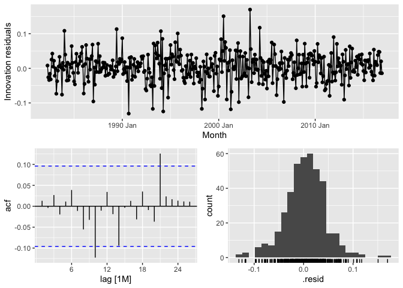<!-- -->

We can see there is some evidence of autocorrelation in the residuals of
our ETS model, as there are some significant lags. We will confirm this
with a Ljung-Box test further below.

#### Forecasts

``` r
# Plotting 2 year forecasts for ETS model

fit_optimal %>%
  forecast(h = 24) %>%
  filter(.model == "ets_aada") %>%
  autoplot(myseries %>%
             filter(year(Month) < 2017)) +
  labs(title = "Takeaway Food Services - Two Year Forecast (ETS)",
       subtitle = "New South Wales",
       y = "Turnover [$million AUD]") +
  theme_bw()
```

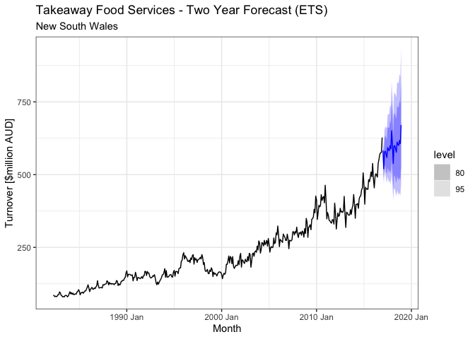<!-- -->

#### Ljung-Box Test

``` r
# Peforming Ljung-Box Test

fit_optimal %>%
  augment() %>%
  filter(.model == "ets_aada") %>%
  features(.innov, 
           ljung_box, 
           lag = 24, 
           # 17 degrees of freedom since we have 18 coefficients, must subtract 1 for an ETS model
           dof = 17) %>%
  kable()
```

| State           | Industry               | .model    | lb\_stat | lb\_pvalue |
|:----------------|:-----------------------|:----------|---------:|-----------:|
| New South Wales | Takeaway food services | ets\_aada | 23.19036 |  0.0015792 |

After performing a Ljung-Box test, we attain a p-value of **0.0015792**.
At a 95% level of significance, we can reject the null hypothesis that
residuals are white noise (i.i.d, with mean 0). However, looking at the
ACF, we can see that the lags are only slightly significant, only just
passing the blue lines at lags 10 and 21. In any case, it is important
to note that because we cannot say that the residuals are white noise
the our forecast may be biased, despite the lags only just passing the
blue lines.

## ARIMA

#### Parameter estimates

``` r
# ARIMA

# Parameter estimates

fit_optimal %>%
  select(arima_auto) %>%
  report() 
```

    ## Series: Turnover 
    ## Model: ARIMA(2,0,2)(0,1,1)[12] w/ drift 
    ## Transformation: log(Turnover) 
    ## 
    ## Coefficients:
    ##          ar1      ar2      ma1     ma2     sma1  constant
    ##       1.7674  -0.7816  -1.0119  0.2119  -0.8378     7e-04
    ## s.e.  0.1874   0.1774   0.1861  0.0559   0.0328     1e-04
    ## 
    ## sigma^2 estimated as 0.00172:  log likelihood=709.53
    ## AIC=-1405.06   AICc=-1404.78   BIC=-1377.03

#### Residual diagnostics

``` r
# Residual diagnostics

fit_optimal %>%
  select(arima_auto) %>%
  gg_tsresiduals()
```

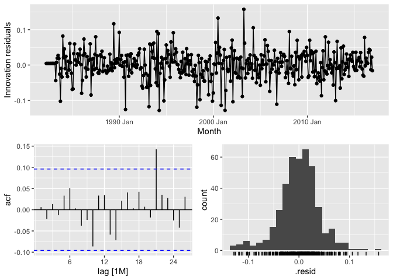<!-- -->

There is only one significant spike at lag 21, however this is 1 out of
24 lags, which is expected since we are testing a large number of lags.
To confirm our residuals are behaving as desired, we can perform a
Ljung-Box test, which is done so further below.

#### Forecasts

``` r
# Plotting 2 year forecasts for ARIMA model

fit_optimal %>%
  forecast(h = 24) %>%
  filter(.model == "arima_auto") %>%
  autoplot(myseries %>%
             filter(year(Month) < 2017)) +
  labs(title = "Takeaway Food Services - Two Year Forecast (ARIMA)",
       subtitle = "New South Wales",
       y = "Turnover [$million AUD]") +
  theme_bw()
```

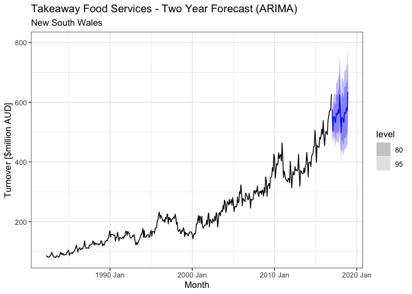<!-- -->

#### Ljung-Box Test

``` r
# Performing Ljung-Box Test

fit_optimal %>%
  augment() %>%
  filter(.model == "arima_auto") %>%
  features(.innov, 
           ljung_box, 
           lag = 24, 
           dof = 6) %>%
  kable()
```

| State           | Industry               | .model      | lb\_stat | lb\_pvalue |
|:----------------|:-----------------------|:------------|---------:|-----------:|
| New South Wales | Takeaway food services | arima\_auto | 22.72279 |  0.2014686 |

After performing a Ljung-Box test, we attain a p-value of **0.2014686**.
At a 95% level of significance, we fail to reject the null hypothesis
that residuals are white noise (i.i.d, with mean 0). This is the ideal
situation, as one of the assumptions of our forecasts are that our
residuals are white noise.

# Comparison of results from both models

Looking at the above analysis, it is quite clear that our results
indicate that the *ARIMA model would be a more optimal model than our
ETS model*.

``` r
# Accuracy metrics on 2 year forecasts for ETS and ARIMA models

fit_optimal %>%
  forecast(h = 24) %>%
  accuracy(myseries) %>%
  arrange(RMSE) %>%
  kable()
```

| .model      | State           | Industry               | .type |         ME |     RMSE |       MAE |        MPE |     MAPE |     MASE |     RMSSE |      ACF1 |
|:------------|:----------------|:-----------------------|:------|-----------:|---------:|----------:|-----------:|---------:|---------:|----------:|----------:|
| arima\_auto | New South Wales | Takeaway food services | Test  |  -2.067089 | 10.23568 |  8.108701 | -0.4036503 | 1.469109 | 0.349673 | 0.3274988 | 0.6451296 |
| ets\_aada   | New South Wales | Takeaway food services | Test  | -34.826956 | 36.44030 | 34.826956 | -6.2975487 | 6.297549 | 1.501849 | 1.1659365 | 0.5832856 |

Firstly, the RMSE and MAE values of our ARIMA model are much smaller
than our ETS model, indicating it makes much better predictions on our
test data (or in other words, data it hasn’t seen). On top of this, the
residuals of our ETS model appear to show evidence of autocorrelation,
confirmed by the Ljung-Box test we have performed, meaning that we
cannot completely trust our forecasts from the ETS model.

# Applying models to full data set and producing out-of-sample forecasts

``` r
# Fitting models

fit_full_optimal <- myseries %>%
  model(
    arima_auto = ARIMA(log(Turnover)),
    ets_aada = ETS(log(Turnover) ~ error("A") + trend("Ad") + season("A"))
  )

# Producing out of sample forecasts for two years

# Forecasts

optimal_full_forecasts <- fit_full_optimal %>%
  forecast(h = 24) 
```

## ETS

#### 80% Prediction intervals

``` r
# Prediction intervals

optimal_full_forecasts %>%
  hilo(level = 80) %>% 
  filter(.model == "ets_aada") %>%
  select(Month, Turnover, .mean, `80%`) %>%
  kable()
```

| Month    | Turnover          |    .mean | 80%                      |
|:---------|:------------------|---------:|:-------------------------|
| 2019 Jan | t(N(6.4, 0.0017)) | 583.9963 | \[553.5645, 615.0616\]80 |
| 2019 Feb | t(N(6.3, 0.0027)) | 521.0334 | \[486.7108, 556.2645\]80 |
| 2019 Mar | t(N(6.4, 0.0038)) | 580.6737 | \[535.7986, 626.9495\]80 |
| 2019 Apr | t(N(6.4, 0.0048)) | 579.8483 | \[529.2466, 632.2414\]80 |
| 2019 May | t(N(6.3, 0.0059)) | 568.5826 | \[513.8406, 625.4714\]80 |
| 2019 Jun | t(N(6.3, 0.007))  | 556.0165 | \[497.8753, 616.6436\]80 |
| 2019 Jul | t(N(6.4, 0.0081)) | 588.0863 | \[522.0468, 657.1690\]80 |
| 2019 Aug | t(N(6.4, 0.0092)) | 581.2978 | \[511.7912, 654.2265\]80 |
| 2019 Sep | t(N(6.4, 0.01))   | 578.0641 | \[504.9549, 654.9930\]80 |
| 2019 Oct | t(N(6.4, 0.011))  | 594.1196 | \[515.0681, 677.5300\]80 |
| 2019 Nov | t(N(6.4, 0.013))  | 582.3704 | \[501.2067, 668.2362\]80 |
| 2019 Dec | t(N(6.5, 0.014))  | 644.0109 | \[550.3451, 743.3563\]80 |
| 2020 Jan | t(N(6.4, 0.015))  | 595.5669 | \[504.6496, 692.2916\]80 |
| 2020 Feb | t(N(6.3, 0.016))  | 531.2608 | \[447.1739, 620.9321\]80 |
| 2020 Mar | t(N(6.4, 0.018))  | 591.9675 | \[495.0412, 695.5713\]80 |
| 2020 Apr | t(N(6.4, 0.019))  | 591.0241 | \[491.1142, 698.0594\]80 |
| 2020 May | t(N(6.4, 0.02))   | 579.4434 | \[478.4932, 687.8334\]80 |
| 2020 Jun | t(N(6.3, 0.021))  | 566.5437 | \[464.9802, 675.8293\]80 |
| 2020 Jul | t(N(6.4, 0.023))  | 599.1238 | \[488.7635, 718.1283\]80 |
| 2020 Aug | t(N(6.4, 0.024))  | 592.1142 | \[480.1867, 713.0612\]80 |
| 2020 Sep | t(N(6.4, 0.025))  | 588.7291 | \[474.6582, 712.2459\]80 |
| 2020 Oct | t(N(6.4, 0.026))  | 604.9890 | \[484.9638, 735.2162\]80 |
| 2020 Nov | t(N(6.4, 0.028))  | 592.9368 | \[472.6067, 723.7551\]80 |
| 2020 Dec | t(N(6.5, 0.029))  | 655.6004 | \[519.6264, 803.7161\]80 |

#### Plotting forecasts

``` r
# Plotting 2 year forecasts on ETS model

optimal_full_forecasts %>%
  filter(.model == "ets_aada") %>%
  autoplot(myseries,
           level = 80) +
  labs(title = "Takeaway Food Services - Two Year Out-of-Sample Forecast (ETS)",
       subtitle = "New South Wales",
       y = "Turnover [$million AUD]") +
  theme_bw() 
```

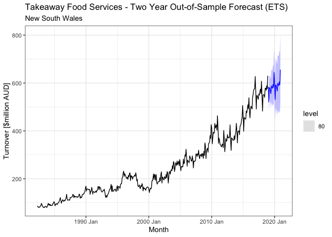<!-- -->

## ARIMA

#### 80% Prediction intervals

``` r
# Prediction intervals

optimal_full_forecasts %>%
  hilo(level = 80) %>% 
  filter(.model == "arima_auto") %>%
  select(Month, Turnover, .mean, `80%`) %>%
  kable()
```

| Month    | Turnover          |    .mean | 80%                      |
|:---------|:------------------|---------:|:-------------------------|
| 2019 Jan | t(N(6.4, 0.0016)) | 574.8039 | \[545.3259, 604.8857\]80 |
| 2019 Feb | t(N(6.2, 0.0026)) | 502.8207 | \[470.4605, 536.0173\]80 |
| 2019 Mar | t(N(6.3, 0.0035)) | 557.5678 | \[515.9256, 600.4646\]80 |
| 2019 Apr | t(N(6.3, 0.0044)) | 559.5361 | \[512.9456, 607.6977\]80 |
| 2019 May | t(N(6.3, 0.0052)) | 553.0034 | \[502.9138, 604.9362\]80 |
| 2019 Jun | t(N(6.3, 0.006))  | 543.7161 | \[491.0337, 598.4784\]80 |
| 2019 Jul | t(N(6.4, 0.0067)) | 577.4727 | \[518.3440, 639.0745\]80 |
| 2019 Aug | t(N(6.4, 0.0073)) | 575.4590 | \[513.7699, 639.8555\]80 |
| 2019 Sep | t(N(6.4, 0.0079)) | 578.0141 | \[513.6174, 645.3537\]80 |
| 2019 Oct | t(N(6.4, 0.0085)) | 595.0274 | \[526.5411, 666.7526\]80 |
| 2019 Nov | t(N(6.4, 0.009))  | 582.9460 | \[513.9703, 655.2802\]80 |
| 2019 Dec | t(N(6.5, 0.0094)) | 645.2562 | \[567.0923, 727.3216\]80 |
| 2020 Jan | t(N(6.4, 0.01))   | 588.2390 | \[514.4190, 665.8842\]80 |
| 2020 Feb | t(N(6.2, 0.011))  | 515.5250 | \[449.0894, 585.5014\]80 |
| 2020 Mar | t(N(6.3, 0.011))  | 572.6975 | \[497.2119, 652.3038\]80 |
| 2020 Apr | t(N(6.3, 0.012))  | 575.7491 | \[498.3952, 657.4125\]80 |
| 2020 May | t(N(6.3, 0.012))  | 570.0264 | \[492.1887, 652.2762\]80 |
| 2020 Jun | t(N(6.3, 0.012))  | 561.4153 | \[483.6942, 643.6069\]80 |
| 2020 Jul | t(N(6.4, 0.013))  | 597.2683 | \[513.6222, 685.7856\]80 |
| 2020 Aug | t(N(6.4, 0.013))  | 596.1536 | \[511.8502, 685.4175\]80 |
| 2020 Sep | t(N(6.4, 0.013))  | 599.7446 | \[514.2455, 690.3183\]80 |
| 2020 Oct | t(N(6.4, 0.013))  | 618.3385 | \[529.5977, 712.3840\]80 |
| 2020 Nov | t(N(6.4, 0.014))  | 606.6738 | \[519.1290, 699.4827\]80 |
| 2020 Dec | t(N(6.5, 0.014))  | 672.4685 | \[574.9974, 775.8285\]80 |

##### Plotting forecasts

``` r
# Plotting 2 year forecasts on ETS model

optimal_full_forecasts %>%
  filter(.model == "arima_auto") %>%
  autoplot(myseries,
           level = 80) +
  labs(title = "Takeaway Food Services - Two Year Out-of-Sample Forecast (ARIMA)",
       subtitle = "New South Wales",
       y = "Turnover [$million AUD]") +
  theme_bw()
```

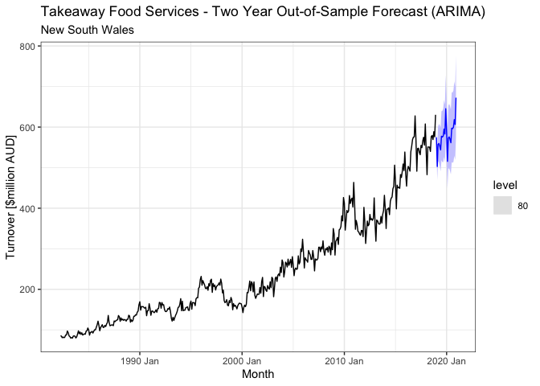<!-- -->

# Comparing with real data from Australian Bureau of Statistics (ABS)

To see how well our models perform on out-of-sample data, we can obtain
real data from the ABS website and compare how accurate our forecasts
are.

``` r
# Loading package necessary to load data from ABS

library(readabs)

# Loading data data for New South Wales Takeaway Services

real_abs_data <- read_abs(series_id = "A3349792X")

# Selecting only necessary columns and filtering out data we did not forecast

real_abs_data_clean <- real_abs_data %>%
  mutate(Month = yearmonth(format(as.Date(date), "%Y-%m")),
         Turnover = value) %>%
  filter(year(Month) < 2021) %>%
  select(Month, Turnover) %>%
  mutate(State = rep("New South Wales", nrow(real_abs_data) - 16),
                     Industry = rep("Takeaway food services", nrow(real_abs_data) - 16)) %>%
  as_tsibble(key = c(State, Industry),
             index = Month)
```

## Plotting real data

#### ETS

``` r
# Whole dataset

optimal_full_forecasts %>%
  filter(.model == "ets_aada") %>%
  autoplot(real_abs_data_clean,
           level = 80) +
  labs(title = "Takeaway Food Services - Two Year Out-of-Sample Forecast (ETS)",
       subtitle = "New South Wales",
       y = "Turnover [$million AUD]") +
  theme_bw()
```

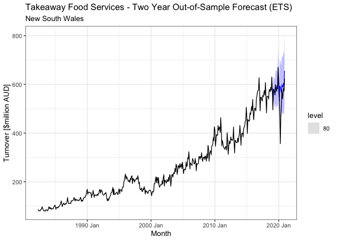<!-- -->

``` r
# Just forecasts

optimal_full_forecasts %>%
  filter(.model == "ets_aada") %>%
  autoplot(real_abs_data_clean %>%
             filter(year(Month) > 2018),
           level = 80) +
  labs(title = "Takeaway Food Services - Two Year Out-of-Sample Forecast (ETS) \n(Forecasts Only)",
       subtitle = "New South Wales",
       y = "Turnover [$million AUD]") +
  theme_bw() 
```

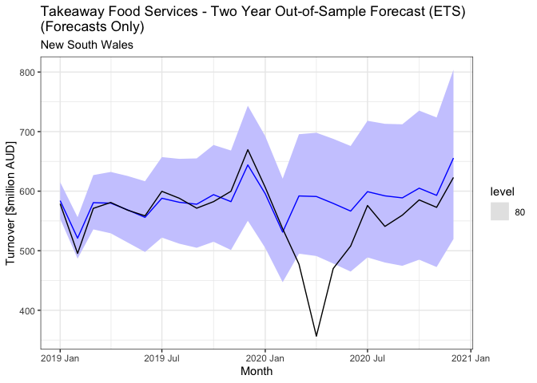<!-- -->

#### ARIMA

``` r
# Whole dataset

optimal_full_forecasts %>%
  filter(.model == "arima_auto") %>%
  autoplot(real_abs_data_clean,
           level = 80) +
  labs(title = "Takeaway Food Services - Two Year Out-of-Sample Forecast (ARIMA)",
       subtitle = "New South Wales",
       y = "Turnover [$million AUD]") +
  theme_bw()
```

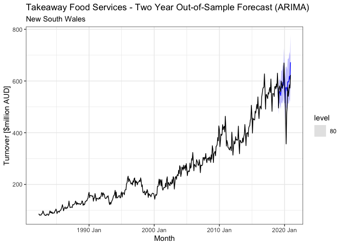<!-- -->

``` r
# Just forecasts

optimal_full_forecasts %>%
  filter(.model == "arima_auto") %>%
  autoplot(real_abs_data_clean %>%
             filter(year(Month) > 2018),
           level = 80) +
  labs(title = "Takeaway Food Services - Two Year Out-of-Sample Forecast (ARIMA) \n(Forecasts Only)",
       subtitle = "New South Wales",
       y = "Turnover [$million AUD]") +
  theme_bw() 
```

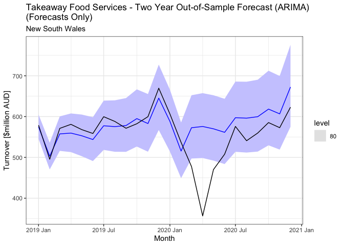<!-- -->

## Computing statistics to evaluate forecasts

``` r
optimal_full_forecasts %>%
  accuracy(real_abs_data_clean) %>%
  kable()
```

| .model      | State           | Industry               | .type |        ME |     RMSE |      MAE |       MPE |     MAPE |     MASE |    RMSSE |      ACF1 |
|:------------|:----------------|:-----------------------|:------|----------:|---------:|---------:|----------:|---------:|---------:|---------:|----------:|
| arima\_auto | New South Wales | Takeaway food services | Test  | -22.63846 | 58.97858 | 38.01135 | -5.305799 | 7.917104 | 1.641802 | 1.891430 | 0.6369411 |
| ets\_aada   | New South Wales | Takeaway food services | Test  | -27.94998 | 61.79123 | 34.74515 | -6.379892 | 7.488204 | 1.500727 | 1.981631 | 0.6388138 |


Visually, we can see that both our ARIMA and ETS models did fairly well,
with the majority of our predictions falling within our 80% prediction
intervals. Unfortunately, an unpredictable situation like COVID-19 was
the cause of the massive drop, but this it something no one saw coming,
and as a result is hard to predict for.

Our **ARIMA(2,0,2)(0,1,1)\[12\] w/ drift** model produced a lower RMSE
than our **ETS(A, Ad, A)** model, however had a higher MAE. RMSE tends
to penalise larger errors more than MAE, and looking to minimise the
RMSE looks to provide forecasts of the mean. On the other hand, looking
to minimise MAE looks to provide forecasts of the median. Plotting a
histogram of our original data, we can see that the data is
asymmetrical, and looking to provide forecasts of the median by
minimising the MAE does not make sense, hence the RMSE would be a better
measure in this case, as instead it can indicate which model provides
the most unbiased forecast.

``` r
# Histogram of original data

myseries %>%
  ggplot(aes(x = Turnover)) +
  geom_histogram() +
  labs(title = "Takeaway Food Services (Histogram)",
       subtitle = "New South Wales",
       x = "Turnover [$million AUD]") +
theme_bw()
```

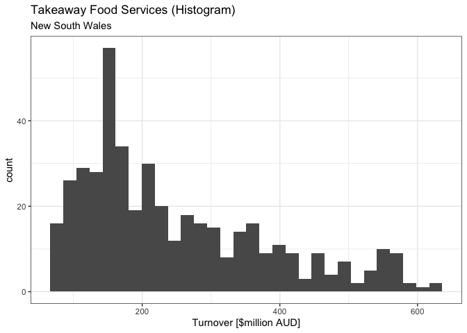<!-- -->

As a result, since our **ARIMA(2,0,2)(0,1,1)\[12\] w/ drift** model
produced a lower RMSE then our **ETS(A, Ad, A)** model, we can say that
our ARIMA model performed better with an out-of-sample forecast.

<!-- -->

# Discussion of benefits and limitations of the chosen models on data

Both ETS and ARIMA models that were chosen performed fairly well on our
data, however both types of models have their own benefits and
limitations. Firstly, ETS models can handle non-stationary data. This is
useful because it is quite rare to find data that is stationary without
any transformations or differencing, *like our turnover data for
takeaway food services in New South Wales*, hence ETS models may be a
convenient option. At the same time, mathematical transformations are
not necessary. While they were applied above (applying a log
transformation), it was possible to simply apply an ETS(M, Ad, M) model,
which is equivalent to applying a log or Box-Cox transformation, then
fitting an ETS(A, Ad, A) model.

On the other hand, ARIMA models handle stationary data, so one
limitation is that data must be stationary before being able to fit an
ARIMA model to data, which requires differencing. However, one benefit
to ARIMA models is that it can be quite useful when autocorrelation
exists in your data (which is the AR (autoregressive) component of
ARIMA), or even in the residuals (which is the MA (moving average)
component of ARIMA), hence it was useful in our *our turnover data for
takeaway food services in New South Wales* since there was clear
evidence of autocorrelation. Moreover, our ARIMA model had significantly
less coefficients than the ETS model, meaning it was a simpler and more
efficient model, providing better forecasts with less parameters.
